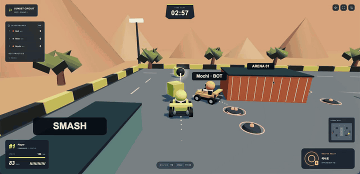

#  GPT-6 Astra × Smash Karts

**A multiplayer 3D kart battle game, built in one Codex session.**

One prompt. About 42 minutes. An arena for up to 8 players, 11 weapons, bot battles,
and a public record of the build.

[Watch gameplay](docs/media/gameplay.mp4) ·
[Explore the agent trajectory](https://huggingface.co/datasets/amsminn/smash-karts-multiplayer-trajectory/blob/main/traces/rollout-2026-09-05T17-40-19-01a070b9-c9b8-7d00-8cbf-8fd0416df521.jsonl) ·
[Run locally](#run-it) · [한국어 실행 가이드](docs/running.md)

[](docs/media/gameplay.mp4)

## The experiment

What happens when you ask a coding agent to build a multiplayer browser game from
a description of its rules?

This repository is the result: **Smash Karts Arena**, an independent implementation
inspired by [Smash Karts](https://smashkarts.io/). Drive through item boxes, grab a
weapon, and compete for the most eliminations in a three-minute round. The arena,
karts, combat effects, and synthesized audio are built in code; the title artwork
was generated separately during the session.

The recorded model identifier is `gpt-6-astra`, running in Codex CLI. The core game
was produced in one coding session on September 5, 2026. Repository packaging,
the gameplay clips, this README, and publication followed afterward.

## What's playable

- **Up to 8 players:** quick matchmaking, private rooms, six-character room codes,
  and invite links.
- **11 weapons:** rockets, burst bullets, a tracking machine gun, cannonballs,
  mines, nukes, Lob-Grenukes, spinning spikes, invincibility, snowballs, and fake
  item boxes.
- **Three-minute free-for-all:** live leaderboard, respawns, spawn protection,
  results, and automatic next rounds.
- **Bot battles:** fill empty online seats or practice locally with four bots.
- **Visible combat:** projectile trails, rocket exhaust, explosions, fragments,
  shockwaves, frozen karts, shields, and synthesized engine and weapon sounds.
- **Server-controlled simulation:** movement, hits, weapons, and scores are
  validated by the game server. Brief disconnects can resume the same player.
- **Keyboard and touch controls**, plus Discord Activity SDK integration.

The clip above shows bot practice. The included multiplayer tests exercise real
WebSocket clients against a separate server process.

## Run it

Requires **Node.js 22.13+** and npm. The game does not require an AI API key.

```sh
git clone https://github.com/amsminn/gpt-6-astra-smash-karts.git
cd gpt-6-astra-smash-karts
npm run setup
npm run dev
```

Open **http://localhost:3000**. The development command starts both the web client
on port 3000 and the game server on port 3001. The interface is primarily Korean.

### Play with friends

1. Connect to the same server. On a shared LAN, use `http://<host-ip>:3000`.
2. Select **방 만들기** to create a room, then click its **ROOM** code to copy an
   invitation link.
3. Friends can follow the link or select **코드로 입장** and enter the room code.
4. Turn off **빈자리 봇** before creating a room for a human-only match.

**빠른 배틀** joins public matchmaking. **혼자 연습하기** starts local bot practice.
Playing across different networks requires a reachable game server.

## Controls

| Action | Input |
| --- | --- |
| Accelerate | `W` / `↑` |
| Brake / reverse | `S` / `↓` |
| Steer | `A`, `D` / `←`, `→` |
| Use weapon / keep firing | `Space` / hold `Space` |
| Leaderboard | `Tab` |
| Menu | `Esc` — the match continues |

Touch controls appear automatically on supported devices.

## Host a match

```sh
npm run build
npm start
```

The production server serves the client and WebSocket endpoint `/ws` together at
**http://localhost:3001**. Docker configuration is also included:

```sh
docker compose up --build -d
```

For internet play, put the service behind HTTPS with WebSocket upgrade support.
Rooms live in one server process and reset when it restarts. See the
[deployment and environment guide](docs/running.md#일반-서버에-배포) for configuration.

The Sites build supports the browser client and bot practice; online matches
require the Node game server. Discord Activity integration additionally requires
your own Discord application and URL mappings. Actual play inside Discord and
Docker container execution have not been verified. See the
[Discord setup guide](docs/discord-activity.md).

## Agent trajectory

The original coding session is published on Hugging Face:

**[amsminn/smash-karts-multiplayer-trajectory](https://huggingface.co/datasets/amsminn/smash-karts-multiplayer-trajectory/blob/main/traces/rollout-2026-09-05T17-40-19-01a070b9-c9b8-7d00-8cbf-8fd0416df521.jsonl)**

| Detail | Recorded value |
| --- | --- |
| Session | Smash Karts 멀티플레이 구현해줘 |
| Model identifier | `gpt-6-astra` |
| Harness | Codex CLI `0.153.4` |
| Duration | About 42 minutes |
| Format | Native Codex JSONL |
| Size | 385 records · approximately 6.4 MB |

Prompts, tool calls, outputs, and embedded images retain their original event
structure. One repository access credential was masked in all five occurrences
before publication. The dataset contains the parent session; separate sub-agent
session files are not bundled.

<details>
<summary>The original prompt (Korean)</summary>

> smash karts 구현해줘. smash karts는 discord 내에서 플레이할 수 있는 web 3d 게임임. 이게 지금 한국디코에선 막혀서 못한다. 멀티 플레이 가능하게 구성하고, smash karts 원본의 게임 룰이나 아이템 사용 효과나 뭐 조작키 이런건 동일하게 구성해줘. 총알이나 나가는거 이펙트 잘 보이게 해줘야함. smash karts 정보 잘 검색해보고 구현해봐라. 디자인 같은 부분은 좀 달라도 됨. /goal

</details>

## Inside the game

| Part | Implementation |
| --- | --- |
| Rendering | Three.js, procedural arena and kart models |
| Interface | React, TypeScript, Tailwind CSS |
| Audio | Web Audio synthesis |
| Multiplayer | Node.js + `ws`; 30 Hz simulation, 15 Hz snapshots |
| Shared rules | `game/game/simulation.ts`, used by the server and local practice |
| Client connection | `game/game/connection.ts` |
| Server and rooms | `game/server/index.ts` |
| Discord | `@discord/embedded-app-sdk` |

Original game rules and weapon behavior were researched from public sources.
Exact physics and balance values are approximations; the project uses its own
map, models, interface, and sound effects. The
[research and differences](docs/rules-and-sources.md) document explains the choices.

## Validation

```sh
npm test
npm run typecheck
npm run lint
npm run build
```

**23 tests pass**, covering room sharing and isolation, movement synchronization,
reconnection, weapon effects, pickups, collision, round timing, and bot battles.
Type checking, linting, and the standalone production build also pass.
