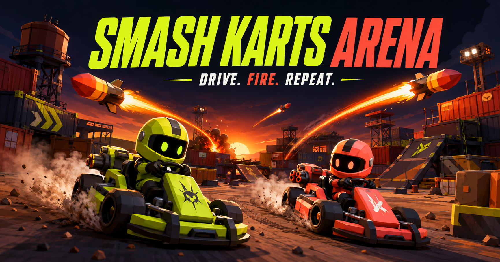

# Smash Karts Arena

Smash Karts의 공개된 조작·개인전 규칙·아이템 동작을 참고해 독립 구현한 **실시간 3D 카트 배틀**입니다. 원본 소스나 그래픽을 사용하지 않았으며, 원본 서비스에 접속하거나 차단을 해제하는 프로그램은 아닙니다.



아래 명령은 모두 저장소 루트에서 실행합니다.

## 실행

Node.js 22.13 이상이 필요합니다.

```sh
npm run setup
npm run dev
```

브라우저에서 **http://localhost:3000**을 엽니다. 개발 명령은 웹 화면(3000)과 게임 서버(3001)를 함께 실행합니다. 현재 구현 파일은 `game/`에 있습니다. 기존 루트 설정 파일을 보존하기 위해 게임 프로젝트를 하위 폴더에 구성했습니다.

다른 사람과 플레이하려면:

1. 모두 같은 서버의 웹 주소에 접속합니다. 같은 Wi-Fi/LAN에서는 `http://서버컴퓨터의내부IP:3000`을 사용합니다.
2. 한 사람이 **방 만들기**를 누르고, 화면 왼쪽의 **ROOM 코드**를 눌러 초대 링크를 복사합니다.
3. 친구가 링크 또는 **코드로 입장**의 6자리 코드로 같은 방에 들어옵니다.
4. 사람끼리만 플레이하려면 방을 만들기 전에 **빈자리 봇**을 끕니다. 방은 최대 8명입니다.

**빠른 배틀**은 공개 방에 매칭합니다. **혼자 연습하기**는 서버 연결 없이 이 기기에서 봇 4대와 같은 규칙으로 플레이합니다. 온라인 연결 실패를 봇 매칭으로 위장하지 않습니다. 봇은 이름 옆에 BOT으로 표시합니다.

서로 다른 네트워크에서는 아래 배포 절차로 공개 HTTPS 주소를 운영해야 합니다. `localhost`는 다른 사람의 컴퓨터에 공유할 수 있는 주소가 아닙니다.

## 조작과 규칙

| 입력 | 동작 |
| --- | --- |
| W / ↑ | 전진 |
| S / ↓ | 감속·후진 |
| A, D / ←, → | 좌우 조향 |
| Space | 아이템 사용 / 누르고 연속 발사 |
| Tab | 현재 순위표 |
| Esc | 게임 메뉴 (경기는 계속 진행) |

터치 기기에는 조향·전진·후진·발사 버튼이 표시됩니다. 별도 점프·드리프트 키는 추가하지 않았습니다.

- 3초 준비 후 **3분 개인전**. 가장 많은 처치 수가 승리하며 동점은 공동 우승입니다.
- 아이템 상자를 지나가면 무기 하나를 무작위 획득합니다.
- 파괴 시 2.5초 후 재생성, 이후 2초 보호. 점수는 그대로 유지됩니다.
- 경기가 끝나면 결과를 표시하고 10초 후 새 경기를 준비합니다.
- 체력·충돌·아이템·발사체·점수는 **서버가 판정**합니다. 클라이언트는 주행·발사 입력만 보냅니다.
- 네트워크가 잠깐 끊기면 최대 20초 동안 기존 플레이어로 재접속을 시도합니다.

11가지 무기: 로켓, 삼연발 탄환, 자동 추적 기관총, 곡사포, 지뢰, 핵탄두, Lob-Grenuke, 회전 철퇴, 무적, 눈덩이, 가짜 아이템 상자. 각 효과는 게임 내 **게임 방법**과 [규칙 조사 문서](rules-and-sources.md)에 있습니다.

렌더링은 Three.js입니다. 밝은 탄환 궤적, 로켓 배기, 포물선 포탄, 폭발 섬광·파편·충격파, 피격 흔들림, 빙결과 보호막, 철퇴 회전, 엔진·무기 사운드를 구현했습니다. 모델·아레나는 코드에서 생성하는 독립 디자인입니다.

## 일반 서버에 배포

```sh
npm run build
npm start
```

**http://localhost:3001** 한 주소에서 웹 파일과 WebSocket `/ws`를 함께 제공합니다. 방 데이터는 메모리에 있으며 서버 재시작 시 초기화됩니다. 단일 서버 프로세스를 기준으로 구성되어 있습니다. 여러 복제본으로 수평 확장하려면 별도의 방 라우팅과 공유 상태 설계가 필요합니다.

Docker 환경에서는 저장소 루트에서:

```sh
docker compose up --build -d
```

HTTPS와 WebSocket 업그레이드를 지원하는 역방향 프록시 뒤에 3001 포트를 연결하세요. 프록시는 `/ws`의 Upgrade/Connection 헤더를 전달해야 합니다. Docker 구성은 제공했으며 이 작업 환경에서는 컨테이너 실행 검증은 하지 않았습니다.

환경 설정이 필요하면 `cp .env.example game/.env` 후 편집합니다. 변경된 `VITE_*` 값은 빌드를 다시 해야 적용됩니다.

| 환경 변수 | 의미 |
| --- | --- |
| `PORT` | Node 서비스 포트. 기본 3001 |
| `ALLOWED_ORIGINS` | 추가 허용 웹 출처. 쉼표로 구분한 정확한 origin. 같은 호스트는 기본 허용 |
| `VITE_GAME_SERVER_URL` | 화면을 별도 호스팅할 경우 `wss://게임서버/ws`. 기본은 같은 출처의 `/ws` |
| `VITE_DISCORD_CLIENT_ID` | Discord 앱의 공개 Application ID. 선택 사항 |

게임 설정에서 외부 WebSocket 서버 주소를 직접 지정할 수도 있습니다. HTTPS 페이지에서는 `wss://`를 사용해야 합니다.

`game/.openai/hosting.json`이 있는 Sites 빌드는 **브라우저 클라이언트/봇 연습용**입니다. Sites 배포만으로 상시 실행 Node 게임 서버가 생기지는 않습니다. 서버가 없으면 첫 화면이 봇 배틀로 안내하며, 온라인 플레이는 외부 게임 서버를 연결해야 합니다. Sites 공개/공유 권한 역시 게임 서버와 별개입니다.

## Discord Activity

SDK 연결과 같은 Activity 인스턴스의 자동 방 매칭을 구현했습니다. 브라우저 플레이에는 Discord 계정이 필요하지 않습니다.

Discord 내부 실행에는 본인 Discord Developer Portal에서 앱을 만들고 Activities를 활성화하는 작업이 필요합니다. Application ID와 배포 주소가 제공되지 않아 앱 등록/실제 Discord 실행은 완료하거나 검증하지 않았습니다. [구체적인 설정 절차](discord-activity.md)를 따르세요.

## 검증

```sh
npm test
npm run typecheck
npm run lint
npm run build
```

테스트는 실제 별도 WebSocket 서버와 클라이언트를 띄워 방 공유·격리·이동 동기화·재접속·잘못된 방 입장 처리를 확인합니다. 시뮬레이션 테스트에서는 11가지 무기, 피격, 보호막, 빙결, 상자 재생성, 경기 시간과 봇 전투를 검사합니다.

브라우저에서의 실제 플레이 감각·GPU 성능과 Discord 앱 내부 동작은 자동 테스트가 보장하지 않습니다. 원본의 정확한 서버 수치는 공개되지 않아 동일한 물리/밸런스를 보장하지 않습니다. 차이는 [조사 문서](rules-and-sources.md)에 명시했습니다.

## 구조

- `game/game/simulation.ts`: 서버·연습 모드 공통 규칙과 판정
- `game/server/index.ts`: 방 관리, WebSocket, 정적 파일 서비스
- `game/game/connection.ts`: 접속, 재접속, 입력 송신
- `game/game/renderer.ts`, `audio.ts`: Three.js와 Web Audio
- `game/app/page.tsx`, `globals.css`: 로비, HUD, 도움말, 터치 조작
- `game/tests/`: 규칙 및 실제 네트워크 통합 테스트
- `Dockerfile`, `compose.yaml`: 전체 멀티플레이 서비스 배포
